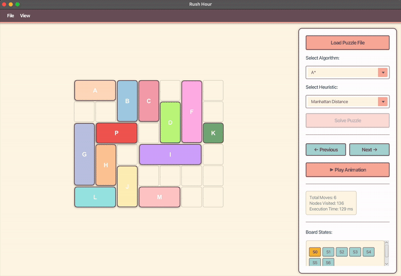

# Rush Hour Puzzle Solver



## Program Description
This program is an implementation of a solver for the Rush Hour puzzle game using various pathfinding algorithms. Rush Hour is a puzzle game where players must move the red car (primary piece) to the exit through traffic congestion by sliding other vehicles that block the way. The program provides implementations of A*, Greedy Best-First Search (GBFS), Uniform Cost Search (UCS), and Dijkstra algorithms to solve the puzzle with a minimal number of moves.

## Requirements
- Java JDK 11 or newer
- JavaFX SDK 17 or newer
- Operating systems: Windows, macOS, or Linux

## How to Compile and Run
1. Make sure Java JDK 11 or newer is installed on your system.
2. Download JavaFX SDK from the [official website](https://gluonhq.com/products/javafx/) and extract it to the `lib` folder in the project.
3. Navigate to the program's root directory via terminal.
4. To compile and run the program, simply use:

```bash
make
```

This single command will compile all the necessary files and automatically launch the application with the correct JavaFX configuration for both Windows and macOS.

## How to Use
1. Once the program is running, the GUI will appear.
2. Click "Load Puzzle File" to load a puzzle file with the appropriate format (.txt)
3. Select an algorithm (A*, GBFS, UCS, or Dijkstra) from the dropdown menu
4. Select a heuristic if using A* or GBFS (Manhattan Distance, Blocking Heuristic, or Combined Heuristic)
5. Click "Solve Puzzle" to solve the puzzle
6. The solution animation will run automatically
7. You can use the "Previous" and "Next" buttons for step-by-step navigation
8. Solution statistics (number of moves, nodes visited, execution time) will be displayed

## Input File Format
The input file must be a text file (.txt) with the following format:
```
A B
N
board_configuration
```
Where:
- A B: board dimensions (A x B)
- N: number of vehicles besides the primary piece
- board_configuration: representation of the board where:
  - 'P': primary piece (the main car that needs to exit)
  - 'K': exit door
  - Other letters: other vehicles
  - '.': empty cell

Example input file:
```
6 6
12
AAB..F
..BCDF
GPPCDFK
GH.III
GHJ...
LLJMM.
```

## Authors

| Name | Student ID |
|------|------------|
| Adinda Putri | 13523071 |
| Shanice Feodora T. | 13523097 |

Class: 02 
Institution: Institut Teknologi Bandung

## Acknowledgements
This program was created to fulfill the requirements of Tugas Kecil 3 for the IF2211 Algorithm Strategies course, Semester II 2024/2025, Informatics Engineering Program, School of Electrical Engineering and Informatics, Institut Teknologi Bandung.
